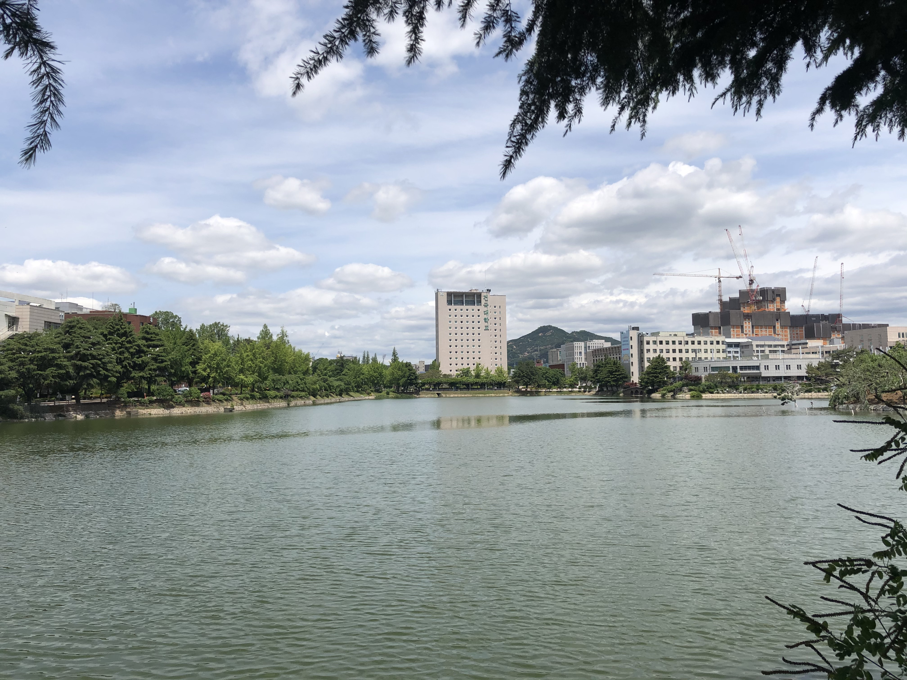
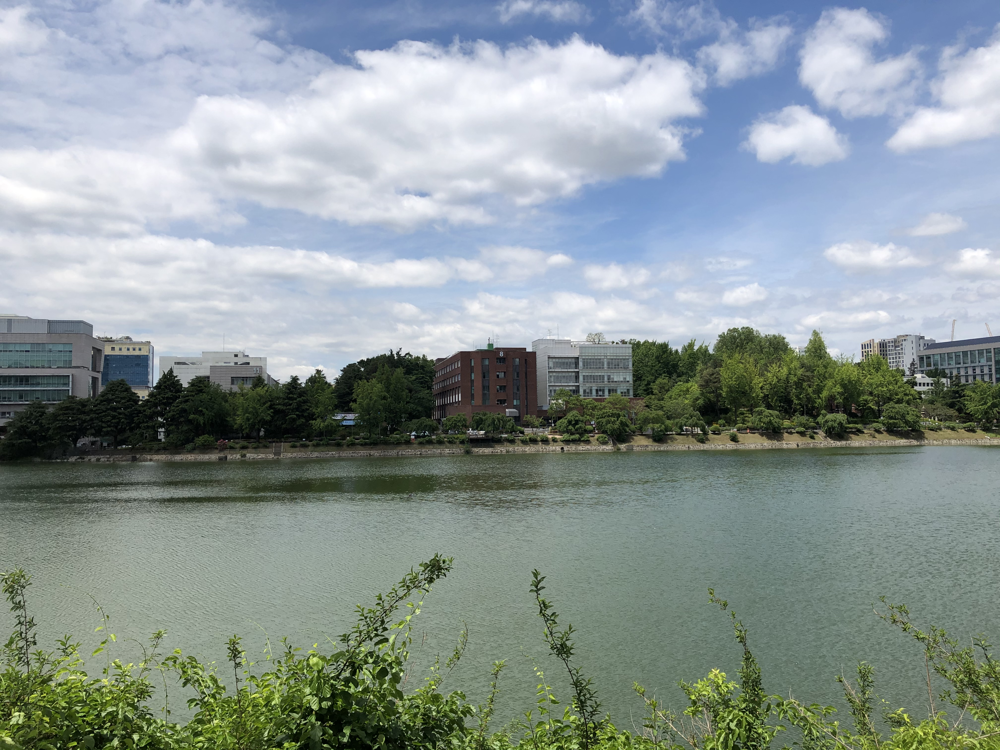

## 2020-05-20

### 일평균 대기질

측정물질 | 서울시 | 광진구
- | - | -
초미세먼지 PM-2.5 (㎍/m3) | 3 | 2
미세먼지 PM-10 (㎍/m3) | 7 | 6
오존 O3 (ppm) | 0.024 | 0.029
이산화질소 NO2 (ppm) | 0.014 | 0.012
일산화탄소 CO (ppm) | 0.3 | 0.3
아황산가스 SO2 (ppm) | 0.002 | 0.003

### 사진 자료

#### 새천년관 (12:31:26)

#### 법학관 (12:33:49)

