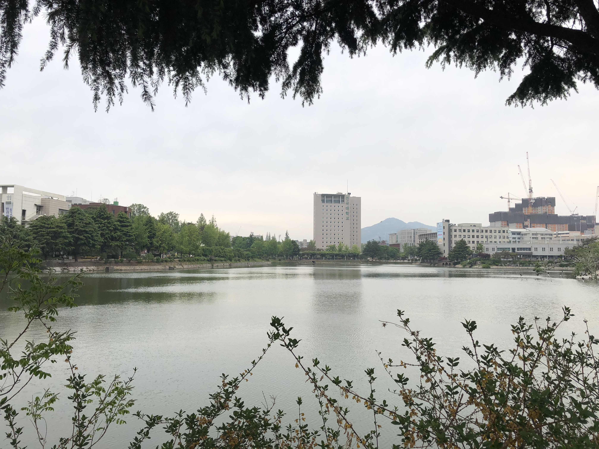
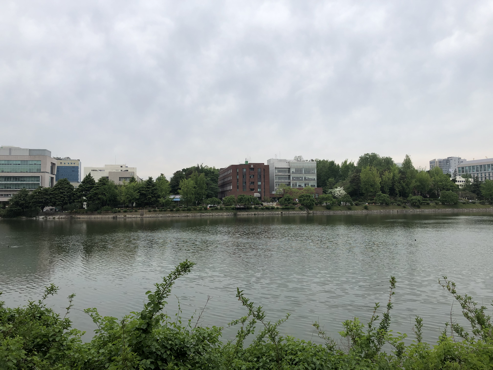

## 2020-05-05

### 일평균 대기질

측정물질 | 서울시 | 광진구
- | - | -
초미세먼지 PM-2.5 (㎍/m3) | 19 | 20
미세먼지 PM-10 (㎍/m3) | 36 | 38
오존 O3 (ppm) | 0.021 | 0.025
이산화질소 NO2 (ppm) | 0.026 | 0.027
일산화탄소 CO (ppm) | 0.5 | 0.7
아황산가스 SO2 (ppm) | 0.003 | 0.005

### 사진 자료

#### 새천년관 (14:41:35)

#### 법학관 (14:44:46)

