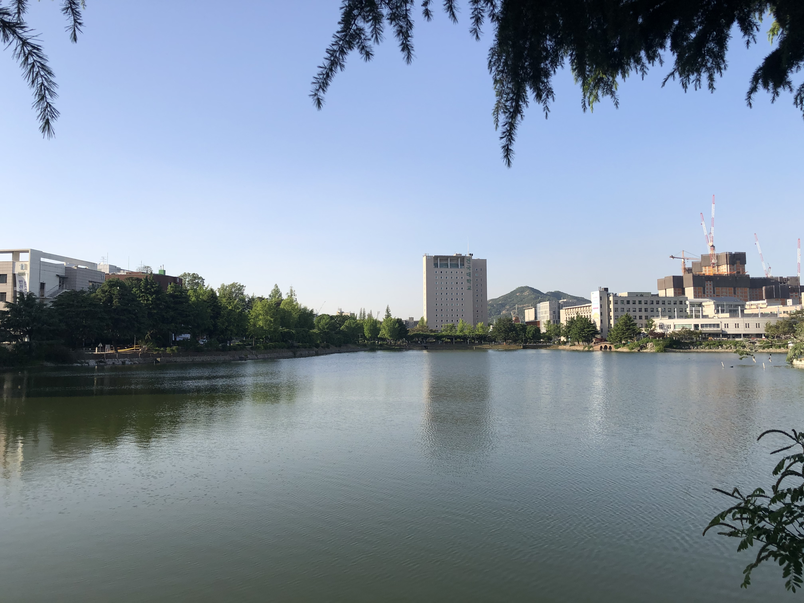
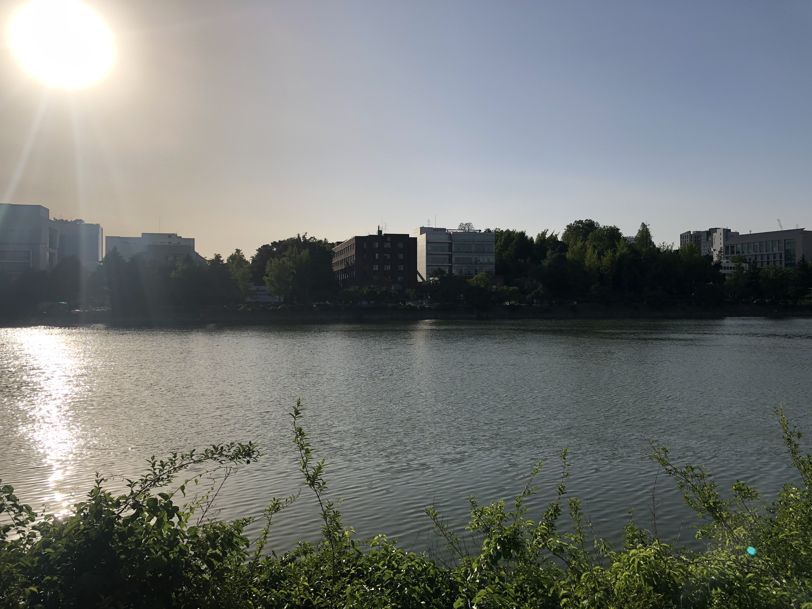

## 2020-05-13

### 일평균 대기질

측정물질 | 서울시 | 광진구
- | - | -
초미세먼지 PM-2.5 (㎍/m3) | 10 | 10
미세먼지 PM-10 (㎍/m3) | 30 | 34
오존 O3 (ppm) | 0.029 | 0.032
이산화질소 NO2 (ppm) | 0.021 | 0.024
일산화탄소 CO (ppm) | 0.3 | 0.5
아황산가스 SO2 (ppm) | 0.003 | 0.004

### 사진 자료

#### 새천년관 (17:51:42)

#### 법학관 (17:46:45)

