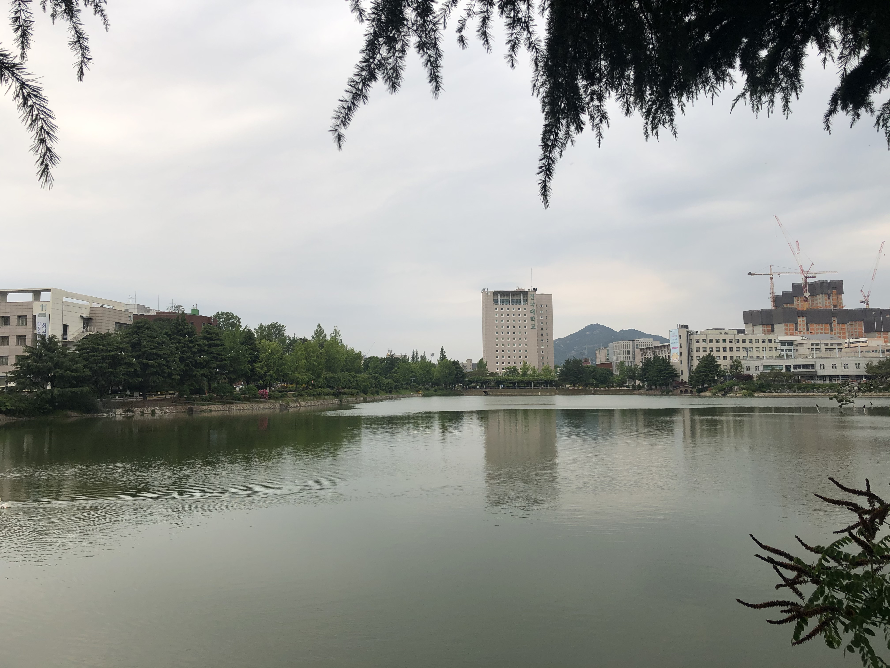
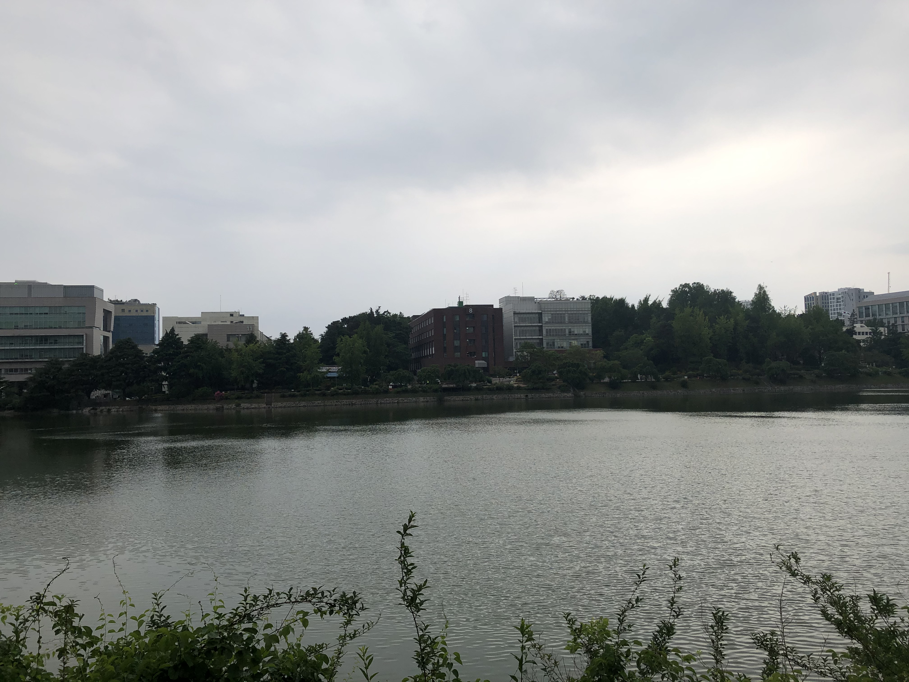

## 2020-05-26

### 일평균 대기질

측정물질 | 서울시 | 광진구
- | - | -
초미세먼지 PM-2.5 (㎍/m3) | 26 | 26
미세먼지 PM-10 (㎍/m3) | 38 | 35
오존 O3 (ppm) | 0.032 | 0.035
이산화질소 NO2 (ppm) | 0.025 | 0.032
일산화탄소 CO (ppm) | 0.5 | 0.6
아황산가스 SO2 (ppm) | 0.003 | 0.003

### 사진 자료

#### 새천년관 (17:58:34)

#### 법학관 (17:52:51)

