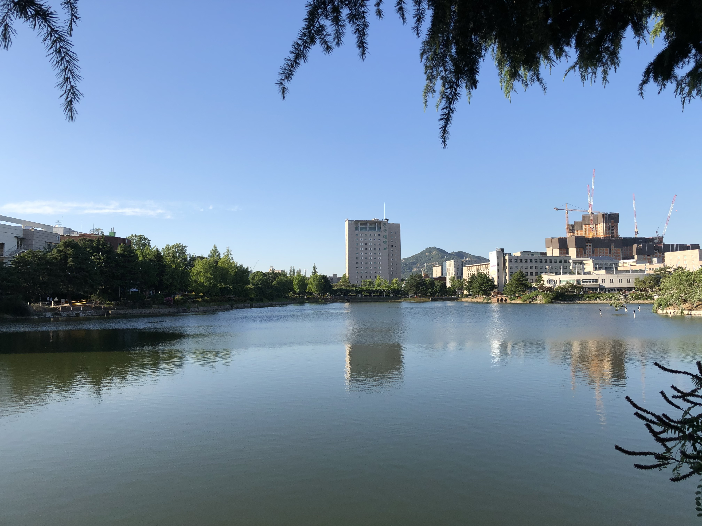
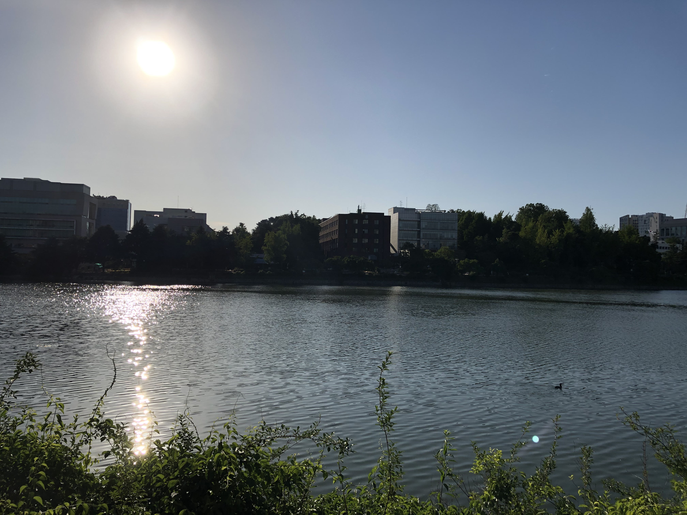

## 2020-06-01

### 일평균 대기질

측정물질 | 서울시 | 광진구
- | - | -
초미세먼지 PM-2.5 (㎍/m3) | 9 | 9
미세먼지 PM-10 (㎍/m3) | 19 | 19
오존 O3 (ppm) | 0.041 | 0.040
이산화질소 NO2 (ppm) | 0.013 | 0.015
일산화탄소 CO (ppm) | 0.3 | 0.3
아황산가스 SO2 (ppm) | 0.002 | 0.003

### 사진 자료

#### 새천년관 (18:01:26)

#### 법학관 (17:58:25)

