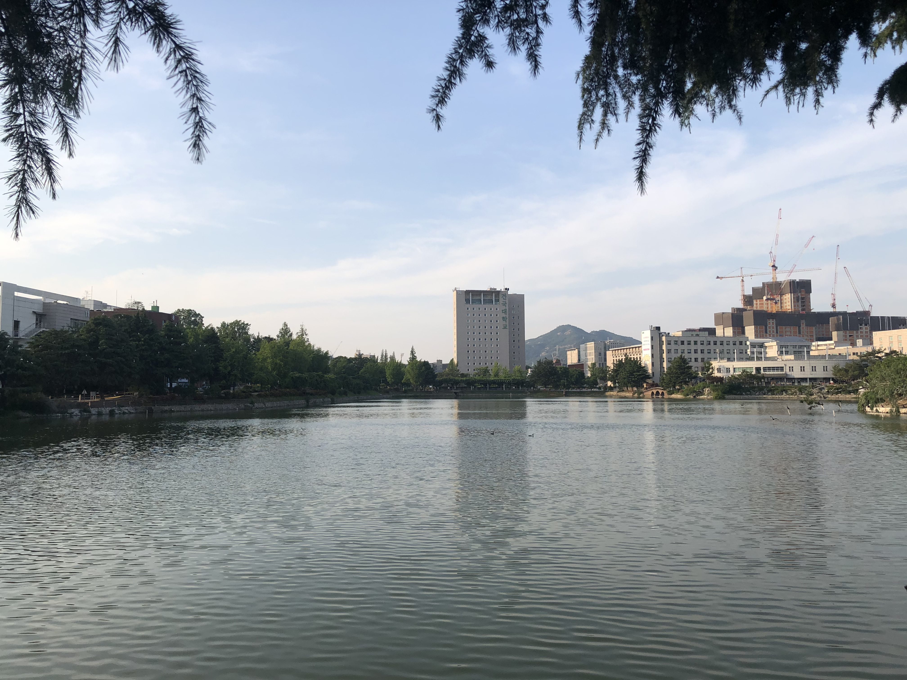
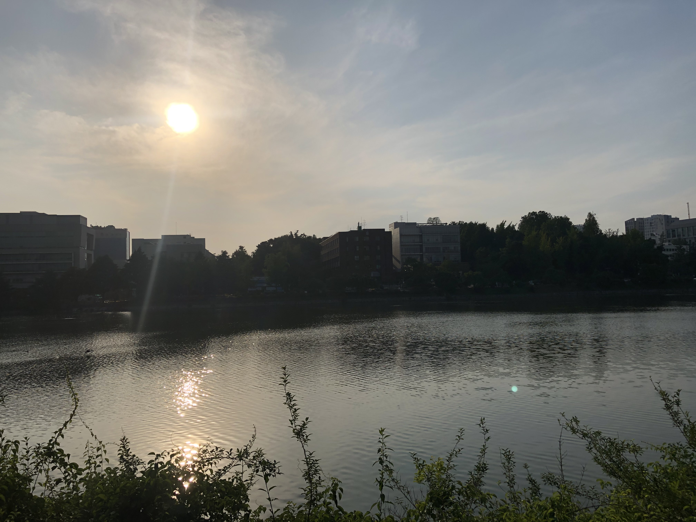

## 2020-06-09

### 일평균 대기질

측정물질 | 서울시 | 광진구
- | - | -
초미세먼지 PM-2.5 (㎍/m3) | 23 | 24
미세먼지 PM-10 (㎍/m3) | 48 | 47
오존 O3 (ppm) | 0.044 | 0.050
이산화질소 NO2 (ppm) | 0.025 | 0.024
일산화탄소 CO (ppm) | 0.4 | 0.5
아황산가스 SO2 (ppm) | 0.003 | 0.003

### 사진 자료

#### 새천년관 (18:18:18)

#### 법학관 (18:16:26)

